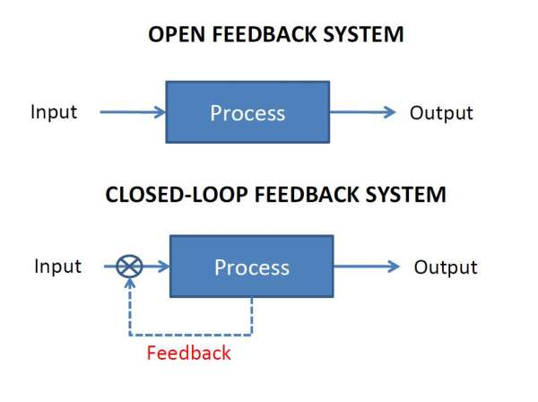

# Follow_line practice
The objective of this practice is to perform a PID reactive control capable of following the line painted on the racing circuit.

## How to execute?
To launch the infrastructure of this practice, first set up the gazebo sources, then launch the simulator with the appropriate scenario:


```
source /opt/jderobot/share/jderobot/gazebo/gazebo-setup.sh
```

```
source /opt/jderobot/share/jderobot/gazebo/gazebo-assets-setup.sh
```

or add them directly to your bashrc to run automatically whenver you open a terminal:

```
echo 'source /opt/jderobot/share/jderobot/gazebo/gazebo-setup.sh' > ~/.bashrc
```

```
echo 'source /opt/jderobot/share/jderobot/gazebo/gazebo-assets-setup.sh' > ~/.bashrc
```

```
source ~/.bashrc
```

Launch Gazebo with the f1_simple_circuit world through the command 

```
roslaunch ./launch/simple_line_follower_ros.launch
```


Then you have to execute the academic application, which will incorporate your code:
```
python2 ./follow_line.py follow_line_conf.yml
```

## How to do the practice?
To carry out the practice, you have to edit the file `MyAlgorithms.py` and insert in it your code, which gives intelligence to the autonomous car.

## Where to insert the code?
[MyAlgorithm.py](MyAlgorithm.py#L87)
```
    def execute(self):
        #GETTING THE IMAGES
        image = self.getImage()

        # Add your code here
        print "Runing"

        #EXAMPLE OF HOW TO SEND INFORMATION TO THE ROBOT ACTUATORS
        #self.motors.sendV(10)
        #self.motors.sendW(5)

        #SHOW THE FILTERED IMAGE ON THE GUI
        self.set_threshold_image(image)
```

### API
* `self.getImage()` - to get the image 
* `self.motors.sendV()` - to set the linear speed
* `self.motors.sendW()` - to set the angular velocity
* `self.set_threshold_image()` - allows you to view a debug image or with relevant information. It must be an image in RGB format (Tip: np.dstack())

## Theory
PID Control is the main fundamental behind this exercise. To understand PID Control, let us first understand what is Control in general.

### Control System
A system of devices or set of devices, that manages, commands, directs or regulates the behavior of other devices or systems to achieve the desired results. Simply speaking, a system which controls other systems. Control Systems help a robot to execute a set of commands precisely, in the presence of unforseen errors.


### Types of Control System
#### Open Loop Control System
A control system in which the control action is completley independent of the output of the system. A manual control system is on Open Loop System.

#### Closed Loop Control System
A control system in which the ouput has an effect on the input quantity in such a manner that the input will adjust itself based on the output generated. An open loop system can be converted to a closed one by providing a feedback.


### PID Control
A control loop mechanism employing feedback. A PID Controller continously calculates an error value as the difference between desired output and the current output and applies a correction based on proporional, integral and derivative terms(denoted by P, I, D respectively).

#### Proportional
Proportional Controller gives an output which is proportional to the current error. The error is multiplied with a proportionality constant to get the output. And hence, is 0 if the error is 0.
#### Integral
Integral Controller provides a necessary action to eliminate the offset error which is accumalted by the P Controller.It integrates the error over a period of time until the error value reaches to zero.
#### Derivative
Derivative Controller gives an output depending upon the rate of change or error with respect to time. It gives the kick start for the output thereby increasing system response.


#### Tuning Methods
In order for the PID equation to work, we need to determine the constants of the equation. There are 3 constants called the gains of the equation. We have 2 main tuning methods for this.
**Trial and Error**: It is a simple method of PID controller tuning. While system or controller is working, we can tune the controller. In this method, first we have to set Ki and Kd values to zero and increase proportional term (Kp) until system reaches to oscillating behavior. Once it is oscillating, adjust Ki (Integral term) so that oscillations stops and finally adjust D to get fast response.

**Zeigler Nichols method**: Zeigler-Nichols proposed closed loop methods for tuning the PID controller. Those are continuous cycling method and damped oscillation method. Procedures for both methods are same but oscillation behavior is different. In this, first we have to set the p-controller constant, Kp to a particular value while Ki and Kd values are zero. Proportional gain is increased till system oscillates at constant amplitude.

## References
For a more practical explanation, have a look at the following links:
[Link1](https://accautomation.ca/tag/pid-control-car-analogy/)
[Link2](https://www.youtube.com/watch?v=UR0hOmjaHp0)

Some other references
https://www.electrical4u.com/control-system-closed-loop-open-loop-control-system/
https://en.wikipedia.org/wiki/PID_controller
https://www.elprocus.com/the-working-of-a-pid-controller/
https://www.tutorialspoint.com/control_systems/control_systems_introduction.htm
https://instrumentationtools.com/open-loop-and-closed-loop-animation/
https://trinirobotics.com/2019/03/26/arduino-uno-robotics-part-2-pid-control/

## Demonstrative video
[Video](https://www.youtube.com/watch?v=eNuSQN9egpA)

* *Base code made by Alberto Martín (@almartinflorido)*
* *Code of practice performed by Francisco Rivas (@chanfr)*
* *Gazebo models and worlds made by Francisco Pérez (@fqez)*
