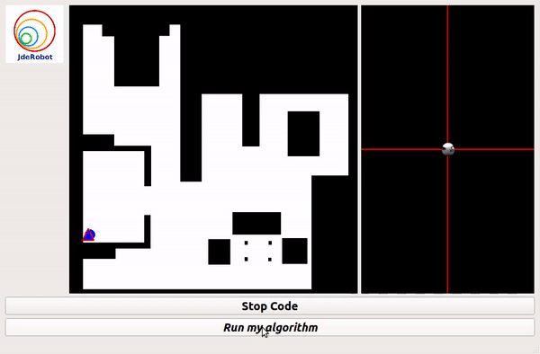

## Hints
Simple hints provided to help you solve the vacuum_slam exercise. Please note that the **full solution has not been provided.** Also, the hints are more related to the reference solution, since multiple solutions are possible for this exercise.

### Grid Representation
Due to the involvement of Localization in this exercise, we are given a map of the surroundings of the robot, which it needs to cover. The map is present in the directory path `resources/images/`. But since, we are using path planning and decomposition algorithms. These are very easy to implement on a grid like structure. Although any data structure, representing adjacency graph would suffice. See the [illustrations](#Illustrations) for what happens without using any data structure(a brute force approach). To implement grids on images, we need to apply basic image processing, which can be accomplished easily using the `opencv` library.

The first step would be to apply erosion function on the map image. This is done in order to ensure some degree of distance between our robot and obstacle during runtime.

The second task is to come up with a **transformation matrix**, that would convert our 3d gazebo positions into 2d map representations. A degree of rotation has to applied on the Y axis and add a translation of 0.6 on the X axis and -1 on the Y axis can be used to get the origin of coordinates (0, 0) of the image in the upper left hand corner.

Once we get **specific positions** on our map. Using the dimensions of our vacuum cleaner, we can generate grid cells around those points. The size of vacuum cleaner can be taken as 16x16 pixel units. Take it as an exercise to calculate it on your own!

### Obstacles and Color Coding
Taking the map as a grayscale image, we can apply **color coding** to the map as well. It is convenient to seperate **Obstacles**, **Virtual Obstacles**, **Return Points** and **Critical Points**

In the context of this exercise,
- **Obstacles**: The obstacles in our map that our robot cannot go over
- **Virtual Obstacles**: The grid cell that our robot has covered.
- **Return Points**: Starting points of the decomposed cells
- **Critical Points**: The points where our robot has stuck between obstacles and virtual obstacles. It is from critical points, that our robot has to start moving towards the next return point.

### Checking for Points
Defining different points simplifies the algorithm as well!

#### Return Points
Return Points can be checked while the robot is in zigzag motion. Empty cells near the robot can be classified as return points. The list of Return Points has to be kept dynamic in order to insert and pop the points whenever required.

#### Critical Points
Critical Points can be classified whenever our robot is stuck around Obstacles or Virtual Obstacles and cannot move any further.

### Checking for Arrival of Cell
Considering various offset errors in the real world(consider simulation to be real world as well!). Arrival of the robot in a particular cell should be considered within a margin of error, otherwise the robot may start oscillating, in the search of a cell on which it can never arrive.

### Efficient Turning and Straight Motion
One trick to adjust the speed and direction of motion is to keep the next 3 cells of the robot which are in it's direction of motion under consideration.

- **All 3 cells are free** Make the robot move at maximum speed
- **2 cells are free**  Make the robot move at a fast speed
- **1 cell is free** Along with small linear motion forward, start applying rotation as well
- **0 cells are free** Stop the robot and apply only rotation

As a final note, quite a lot of tips and tricks regarding implementation have been discussed in this page. This is a tough exercise, which may take **quite a lot of time** to solve. The main objective of the exercise is to cover a **significant area of the house**, without taking time into consideration.

### Illustrations

*Grid Based Approach*

*PID Based(without grid) Approach*
### References
[1](https://gsyc.urjc.es/jmplaza/students/tfg-Robotics_Academy-irene_lope-2018.pdf)

