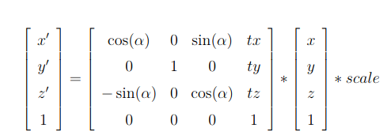
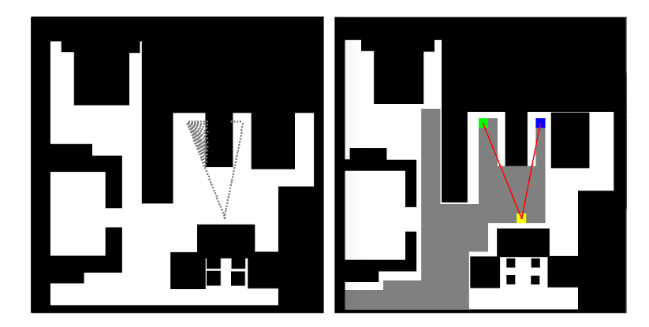

## Theory
As the problem, may have multiple solutions, only the theory behind the reference solution has been covered. 

### Conversion From 3D to 2D
Robot Localization is the process of determining, where robot is located with respect to it's environment. Localization is a an important resource to us in solving this exercise. Localization can be accomplished in any way possible, be it Monte Carlo, Particle Filter, or even Offline Algorithms. Since, we have a map available to us, offline localization is the best way to move forward. Offline Localization will involve converting from a 3D environment scan to a 2D map. There are again numerous ways to do it, but the technique used in exercise is using **transformation matrices**.

#### Transformation Matrices
In simple terms, transformation is an invertible function that maps a set _X_ to itself. Geometrically, it moves a point to some other location in some space. Algebraically, all the transformations can be mapped using matrix representation. In order to apply transformation on a point, we multiply the point with the specific transformation matrix to get the new location. Some important transformations are:

##### Translation
Translation of Euclidean Space(2D or 3D world) moves every point by a fixed distance in the same direction

##### Rotation
Rotation spins the object around a fixed point, known as center of rotation.

##### Scaling
Scaling enlarges or diminishes objects, by a certain given scale factor.

##### Shear
Shear rotates one axis so that the axes are no longer perpendicular.

In order to apply multiple transformations all at the same time, we use the concept of Transformation Matrix which enables us to multiply a single matrix for all the operations at once!

_Transformation Matrix_

In our case we need to map a 3D Point in gazebo, to a 2D matrix map of our house. The equation used in the exercise was:

_Coordinate to Pixel Conversion Equation_

In order to carry out the inverse operation of 3D to 2D, we can simply multiply, the pixel vector with the inverse of the transformation matrix to get the gazebo vector. The inverse of the matrix exists because the **mapping is invertible** and we **do not care about the z coordinate of the environment**, implying that each point in gazebo corresponds to a single point in the map.

### Coverage and Decomposition
After the robot is localized in it's environment, we can employ decomposition techniques in our algorithm, to deal with the actual coverage of the surroundings. There are lot of [decomposition techniques](https://www.cs.cmu.edu/~motionplanning/lecture/Chap6-CellDecomp_howie.pdf) available for our use. The Decomposition Algorithm, decomposes the map into seperate segments, which our robot can cover one by one. Decomposition can be directly related to Graph Theory, where the segments are taken as nodes and the edges connecting nodes depict that the adjacent segments share a common boundary. The robot can path plan to the nearest node and then start the sweeping again! Most of the details regarding decomposition would be implementation

_Adjacency Graph_

### Travelling between segments
Once, a certain segment has been swept. In order to reach the next segment(preferably nearest one) there are again a multitude of [path planning algorithms](http://correll.cs.colorado.edu/?p=965). The algorithm used in the reference solution is the Visibility Algorithm. As the name suggests, visibility of the target is the basic building block. So, let's define visibility first off all!

If a straight line exists between two points, and the line does not pass over obstacles, the two points are said to be visible to each other. Mathematically speaking, the two points under consideration must satisfy a common equation.

 

_Equation of a Line_

Starting from the destination cell, the robot can map it's path one cell at a time, while keeping visibility as a reference, until it reaches the current cell, the robot is present in. Once, the plan has been decided the robot can follow that path and reach it's destination.

_Visibility Error_

But, sometimes due to close proximity to corner, the robot may collide with it. To avoid the occurence of any such event, we may also consider dilation techniques, since the map used is a binary image. Dilation is a Morphological Function that expands the shapes present in the input image. Refer to this [link](https://homepages.inf.ed.ac.uk/rbf/HIPR2/dilate.htm) for more information on dilation.

_Morphological Operations_

For implementation details, refer the [Hints page](HINTS.md).

### References
The major credit for this coverage algorithm goes to [Jose Sir](https://github.com/jmplaza) and his student [Irene](https://github.com/ilope236).

[1](https://onlinelibrary.wiley.com/doi/full/10.1002/047134608X.W8318)

[2](https://en.wikipedia.org/wiki/Transformation_(function))

[3](https://www.cs.cmu.edu/~motionplanning/lecture/Chap6-CellDecomp_howie.pdf)

[4](http://correll.cs.colorado.edu/?p=965)

[5](https://homepages.inf.ed.ac.uk/rbf/HIPR2/dilate.htm)

[6](https://gsyc.urjc.es/jmplaza/students/tfg-Robotics_Academy-irene_lope-2018.pdf)

One of the best [video series on Linear Algebra](https://www.youtube.com/playlist?list=PLZHQObOWTQDPD3MizzM2xVFitgF8hE_ab)

